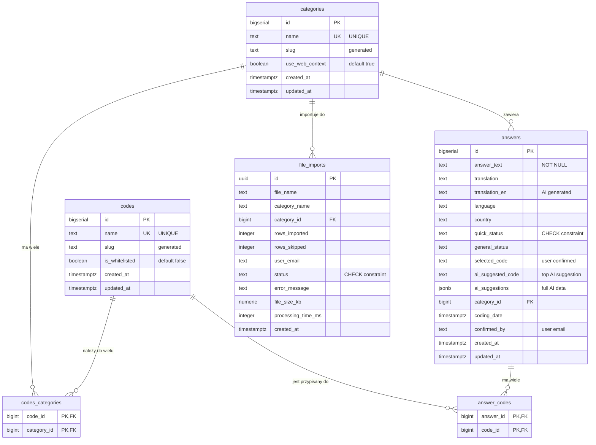

# 🗄️ Schemat Bazy Danych - TGM Research

## 📊 Diagram ERD (Entity Relationship Diagram)



---

## 🏗️ Struktura Relacji

### 1. **Kategorie ↔ Kody** (N:M przez `codes_categories`)

```
┌──────────────┐         ┌───────────────────┐         ┌──────────┐
│ categories   │         │ codes_categories  │         │  codes   │
│              │         │                   │         │          │
│ id (PK)      │◄───────►│ category_id (FK)  │         │ id (PK)  │
│ name         │    1:N  │ code_id (FK)      │◄───────►│ name     │
│ use_web...   │         │                   │    N:1  │ is_white │
└──────────────┘         └───────────────────┘         └──────────┘
     │                                                        │
     │                                                        │
     │ 1:N                                               N:1 │
     ▼                                                        ▼
┌──────────────┐                                    ┌─────────────┐
│   answers    │                                    │answer_codes │
│              │                                    │             │
│ id (PK)      │◄──────────────────────────────────►│ answer_id   │
│ category_id  │                               1:N  │ code_id     │
│ answer_text  │                                    └─────────────┘
│ ai_sugges... │
└──────────────┘
```

**Opis relacji:**
- **Kategoria** może mieć **wiele kodów** (np. "Sports Brands" → Nike, Adidas, Puma)
- **Kod** może należeć do **wielu kategorii** (np. "Nike" → Sports Brands, Clothing Brands)
- **Odpowiedź** należy do **jednej kategorii** (category_id)
- **Odpowiedź** może mieć **wiele kodów** przypisanych (przez `answer_codes`)

---

## 📋 Szczegółowy Opis Tabel

### 🗂️ Tabela: `categories`

**Przeznaczenie:** Organizacja kodów w kategorie (np. "Home Fragrances", "Sports Brands")

**Kolumny:**
| Kolumna | Typ | Opis | Constraints |
|---------|-----|------|-------------|
| `id` | bigserial | Klucz główny | PRIMARY KEY |
| `name` | text | Nazwa kategorii | NOT NULL, UNIQUE |
| `slug` | text | URL-friendly slug | GENERATED, indexed |
| `use_web_context` | boolean | Czy używać Google Search dla AI | DEFAULT true |
| `created_at` | timestamptz | Data utworzenia | DEFAULT NOW() |
| `updated_at` | timestamptz | Data aktualizacji | DEFAULT NOW() |

**Indeksy:**
- PRIMARY KEY on `id`
- UNIQUE on `name`
- INDEX on `slug`

**Przykładowe dane:**
```sql
id | name              | slug               | use_web_context
---+-------------------+--------------------+----------------
1  | Home Fragrances   | home-fragrances    | true
2  | Sports Brands     | sports-brands      | true
3  | Toothpaste Brands | toothpaste-brands  | false
```

**Szacowana liczba wierszy:** 10-50

---

### 🏷️ Tabela: `codes`

**Przeznaczenie:** Kody do przypisywania odpowiedziom (np. "Nike", "Lavender")

**Kolumny:**
| Kolumna | Typ | Opis | Constraints |
|---------|-----|------|-------------|
| `id` | bigserial | Klucz główny | PRIMARY KEY |
| `name` | text | Nazwa kodu | NOT NULL, UNIQUE |
| `slug` | text | URL-friendly slug | GENERATED, indexed |
| `is_whitelisted` | boolean | Automatyczne przypisywanie | DEFAULT false, indexed |
| `created_at` | timestamptz | Data utworzenia | DEFAULT NOW() |
| `updated_at` | timestamptz | Data aktualizacji | DEFAULT NOW() |

**Indeksy:**
- PRIMARY KEY on `id`
- UNIQUE on `name`
- INDEX on `slug`
- INDEX on `is_whitelisted`

**Przykładowe dane:**
```sql
id | name      | slug      | is_whitelisted
---+-----------+-----------+---------------
1  | Nike      | nike      | true
2  | Adidas    | adidas    | true
3  | Lavender  | lavender  | false
4  | Vanilla   | vanilla   | false
```

**Whitelisting:** Jeśli `is_whitelisted = true`, to kod jest **automatycznie przypisywany** do nowych odpowiedzi, które zawierają jego nazwę w tekście (np. answer zawiera "Nike" → auto-assign code "Nike").

**Szacowana liczba wierszy:** 50-500

---

### 🔗 Tabela: `codes_categories` (N:M)

**Przeznaczenie:** Relacja wiele-do-wielu między kodami a kategoriami

**Kolumny:**
| Kolumna | Typ | Opis | Constraints |
|---------|-----|------|-------------|
| `code_id` | bigint | ID kodu | FK → codes(id), ON DELETE CASCADE |
| `category_id` | bigint | ID kategorii | FK → categories(id), ON DELETE CASCADE |

**Constraints:**
- PRIMARY KEY on `(code_id, category_id)`
- FOREIGN KEY `code_id` → `codes(id)` ON DELETE CASCADE
- FOREIGN KEY `category_id` → `categories(id)` ON DELETE CASCADE

**Przykładowe dane:**
```sql
code_id | category_id | (relationship)
--------+-------------+-------------------------------
1       | 2           | Nike → Sports Brands
2       | 2           | Adidas → Sports Brands
3       | 1           | Lavender → Home Fragrances
4       | 1           | Vanilla → Home Fragrances
1       | 5           | Nike → Clothing Brands (multi-category)
```

**Szacowana liczba wierszy:** 100-1000

---

### 💬 Tabela: `answers` (GŁÓWNA TABELA)

**Przeznaczenie:** Odpowiedzi z ankiet/badań do kategoryzacji (10,000+ wierszy)

**Kolumny:**
| Kolumna | Typ | Opis | Constraints |
|---------|-----|------|-------------|
| `id` | bigserial | Klucz główny | PRIMARY KEY |
| `answer_text` | text | Oryginalny tekst odpowiedzi | NOT NULL |
| `translation` | text | Tłumaczenie (edytowalne) | nullable |
| `translation_en` | text | Tłumaczenie EN (AI-generated) | nullable, readonly |
| `language` | text | Język (np. "PL", "EN") | nullable, indexed |
| `country` | text | Kraj (np. "Poland") | nullable, indexed |
| `quick_status` | text | Status szybki | CHECK constraint, indexed |
| `general_status` | text | Status ogólny | nullable, indexed |
| `selected_code` | text | Wybrany kod (user confirmed) | nullable |
| `ai_suggested_code` | text | Top AI suggestion | nullable |
| `ai_suggestions` | jsonb | Pełne sugestie AI | nullable, GIN indexed |
| `category_id` | bigint | ID kategorii | FK → categories(id), indexed |
| `coding_date` | timestamptz | Data kodowania | nullable, indexed DESC |
| `confirmed_by` | text | Email użytkownika | nullable |
| `created_at` | timestamptz | Data utworzenia | DEFAULT NOW() |
| `updated_at` | timestamptz | Data aktualizacji | DEFAULT NOW() |

**Constraints:**
- PRIMARY KEY on `id`
- FOREIGN KEY `category_id` → `categories(id)` ON DELETE SET NULL
- CHECK `quick_status` IN ('Other', 'Ignore', 'Global Blacklist', 'Blacklist', 'Confirmed')

**Indeksy:**
```sql
idx_answers_language              ON language
idx_answers_country               ON country
idx_answers_general_status        ON general_status
idx_answers_quick_status          ON quick_status
idx_answers_coding_date           ON coding_date DESC
idx_answers_category_id           ON category_id
idx_answers_ai_suggestions        USING GIN (ai_suggestions)
idx_answers_ai_suggestions_model  ON ((ai_suggestions->>'model'))
```

**Przykładowy rekord:**
```json
{
  "id": 12345,
  "answer_text": "I love Nike shoes for running!",
  "translation": null,
  "translation_en": "I love Nike shoes for running!",
  "language": "EN",
  "country": "USA",
  "quick_status": "Confirmed",
  "general_status": "whitelist",
  "selected_code": "Nike",
  "ai_suggested_code": "Nike",
  "ai_suggestions": {
    "suggestions": [
      {
        "code_id": "1",
        "code_name": "Nike",
        "confidence": 0.98,
        "reasoning": "User explicitly mentioned 'Nike shoes'"
      },
      {
        "code_id": "2",
        "code_name": "Adidas",
        "confidence": 0.15,
        "reasoning": "Competing sports brand"
      }
    ],
    "model": "gpt-4.1-nano",
    "timestamp": "2025-10-13T10:30:00Z",
    "preset_used": "LLM Brand List"
  },
  "category_id": 2,
  "coding_date": "2025-10-13T10:30:00Z",
  "confirmed_by": "user@example.com",
  "created_at": "2025-10-13T10:00:00Z",
  "updated_at": "2025-10-13T10:30:00Z"
}
```

**Szacowana liczba wierszy:** 10,000+ (główna tabela z danymi)

**Quick Status Values:**
- `'Other'` - Inne (nie pasuje do żadnej kategorii)
- `'Ignore'` - Ignoruj (pomiń w analizie)
- `'Global Blacklist'` - Globalna czarna lista
- `'Blacklist'` - Czarna lista (dla tej kategorii)
- `'Confirmed'` - Potwierdzony (kod zaakceptowany)

---

### 🔗 Tabela: `answer_codes` (N:M)

**Przeznaczenie:** Relacja wiele-do-wielu między odpowiedziami a kodami

**Kolumny:**
| Kolumna | Typ | Opis | Constraints |
|---------|-----|------|-------------|
| `answer_id` | bigint | ID odpowiedzi | FK → answers(id), ON DELETE CASCADE |
| `code_id` | bigint | ID kodu | FK → codes(id), ON DELETE CASCADE |

**Constraints:**
- PRIMARY KEY on `(answer_id, code_id)`
- FOREIGN KEY `answer_id` → `answers(id)` ON DELETE CASCADE
- FOREIGN KEY `code_id` → `codes(id)` ON DELETE CASCADE

**Przykładowe dane:**
```sql
answer_id | code_id | (relationship)
----------+---------+-------------------------------
12345     | 1       | Answer 12345 → Nike
12345     | 8       | Answer 12345 → Running Shoes (multi-code)
12346     | 2       | Answer 12346 → Adidas
12347     | 3       | Answer 12347 → Lavender
```

**Uwaga:** Jedna odpowiedź może mieć **wiele kodów** (np. "Nike running shoes" → kody: "Nike" + "Running Shoes").

**Szacowana liczba wierszy:** 10,000+ (1:1 lub więcej z answers)

---

### 📁 Tabela: `file_imports`

**Przeznaczenie:** Audyt i historia importów plików CSV/Excel

**Kolumny:**
| Kolumna | Typ | Opis | Constraints |
|---------|-----|------|-------------|
| `id` | uuid | Klucz główny | PRIMARY KEY, DEFAULT gen_random_uuid() |
| `file_name` | text | Nazwa pliku | NOT NULL |
| `category_name` | text | Nazwa kategorii (snapshot) | nullable |
| `category_id` | bigint | ID kategorii | FK → categories(id), ON DELETE SET NULL |
| `rows_imported` | integer | Liczba zaimportowanych wierszy | DEFAULT 0 |
| `rows_skipped` | integer | Liczba pominiętych wierszy | DEFAULT 0 |
| `user_email` | text | Email użytkownika | DEFAULT 'system', indexed |
| `status` | text | Status importu | CHECK constraint, indexed |
| `error_message` | text | Komunikat błędu (jeśli failed) | nullable |
| `file_size_kb` | numeric(10,2) | Rozmiar pliku w KB | nullable |
| `processing_time_ms` | integer | Czas przetwarzania w ms | nullable |
| `created_at` | timestamptz | Data importu | DEFAULT NOW(), indexed DESC |

**Constraints:**
- PRIMARY KEY on `id`
- FOREIGN KEY `category_id` → `categories(id)` ON DELETE SET NULL
- CHECK `status` IN ('success', 'failed', 'partial')

**Indeksy:**
```sql
idx_file_imports_created_at   ON created_at DESC
idx_file_imports_status       ON status
idx_file_imports_category_id  ON category_id
idx_file_imports_user_email   ON user_email
```

**Przykładowe dane:**
```sql
id                                   | file_name           | rows_imported | status  | created_at
-------------------------------------+---------------------+---------------+---------+------------
550e8400-e29b-41d4-a716-446655440000 | survey_data_2025.csv| 1523          | success | 2025-10-13...
550e8400-e29b-41d4-a716-446655440001 | answers_import.xlsx | 850           | success | 2025-10-12...
550e8400-e29b-41d4-a716-446655440002 | test_data.csv       | 0             | failed  | 2025-10-11...
```

**Szacowana liczba wierszy:** 100-1000

---

## 🔧 Triggery i Funkcje

### 1. **Trigger: `assign_whitelisted_code()`**

**Przeznaczenie:** Automatyczne przypisywanie whitelistowanych kodów do nowych odpowiedzi

**Kiedy działa:** `BEFORE INSERT ON answers`

**Logika:**
```
IF answer_text ILIKE '%<whitelisted_code_name>%' THEN
  SET selected_code = <code_name>
  SET quick_status = 'Confirmed'
  SET general_status = 'whitelist'
  SET coding_date = NOW()
END IF
```

**Przykład:**
```sql
-- Jeśli kod "Nike" ma is_whitelisted = true
-- I dodajesz odpowiedź: "I love Nike shoes"
INSERT INTO answers (answer_text) VALUES ('I love Nike shoes');
-- Automatycznie ustawia:
-- selected_code = 'Nike'
-- quick_status = 'Confirmed'
-- general_status = 'whitelist'
-- coding_date = NOW()
```

---

### 2. **Funkcja: `get_high_confidence_suggestions()`**

**Przeznaczenie:** Pobranie odpowiedzi z sugestiami AI o wysokiej pewności

**Parametry:**
- `p_category_id` BIGINT (nullable) - Filtruj po kategorii
- `p_min_confidence` REAL (default 0.85) - Minimalna pewność (0.0-1.0)
- `p_limit` INT (default 100) - Limit wyników

**Zwraca:**
```sql
answer_id       BIGINT
answer_text     TEXT
suggested_code  TEXT
confidence      REAL
reasoning       TEXT
model           TEXT
```

**Użycie:**
```sql
-- Pobierz 50 odpowiedzi z sugestiami >90% dla kategorii 1
SELECT * FROM get_high_confidence_suggestions(1, 0.90, 50);
```

---

### 3. **Funkcja: `get_ai_suggestion_accuracy()`**

**Przeznaczenie:** Obliczenie dokładności sugestii AI (porównanie selected_code vs ai_suggested_code)

**Parametry:**
- `p_category_id` BIGINT (nullable)
- `p_days` INT (default 30)

**Zwraca:**
```sql
total_suggestions    BIGINT
correct_suggestions  BIGINT
accuracy_rate        REAL (0.0-1.0)
avg_confidence       REAL (0.0-1.0)
```

**Użycie:**
```sql
-- Sprawdź dokładność AI za ostatnie 30 dni
SELECT * FROM get_ai_suggestion_accuracy(NULL, 30);

-- Wynik przykładowy:
-- total: 1523, correct: 1450, accuracy: 0.952, avg_confidence: 0.89
```

---

### 4. **Funkcja: `get_top_ai_suggested_codes()`**

**Przeznaczenie:** Top najczęściej sugerowane kody przez AI

**Parametry:**
- `p_category_id` BIGINT (nullable)
- `p_limit` INT (default 20)

**Zwraca:**
```sql
code_name         TEXT
suggestion_count  BIGINT
avg_confidence    REAL
min_confidence    REAL
max_confidence    REAL
```

**Użycie:**
```sql
-- Top 20 najczęściej sugerowanych kodów
SELECT * FROM get_top_ai_suggested_codes(NULL, 20);
```

---

### 5. **Funkcja: `get_import_stats()`**

**Przeznaczenie:** Statystyki importów plików

**Parametry:**
- `days` INTEGER (default 7)

**Zwraca:**
```sql
total_imports          BIGINT
successful_imports     BIGINT
failed_imports         BIGINT
total_rows_imported    BIGINT
avg_processing_time_ms NUMERIC
```

**Użycie:**
```sql
-- Statystyki za ostatnie 7 dni
SELECT * FROM get_import_stats(7);
```

---

### 6. **Funkcja: `get_recent_imports()`**

**Przeznaczenie:** Ostatnie importy z detalami

**Parametry:**
- `limit_count` INTEGER (default 20)

**Zwraca:** Wszystkie kolumny z tabeli `file_imports`

**Użycie:**
```sql
-- Ostatnie 20 importów
SELECT * FROM get_recent_imports(20);
```

---

## 📊 Statystyki Bazy Danych

### Szacunkowe Rozmiary

| Tabela | Wierszy | Rozmiar (szacunkowo) |
|--------|---------|----------------------|
| `answers` | 10,000+ | ~5-50 MB (zależy od długości tekstów) |
| `categories` | 10-50 | <1 MB |
| `codes` | 50-500 | <1 MB |
| `codes_categories` | 100-1000 | <1 MB |
| `answer_codes` | 10,000+ | ~1-10 MB |
| `file_imports` | 100-1000 | <1 MB |
| **TOTAL** | **~20,000+** | **~10-70 MB** |

### Indeksy

**Liczba indeksów:** ~15-20

**Rozmiar indeksów:** ~5-20 MB (zależnie od danych)

**Najważniejsze indeksy dla wydajności:**
1. `idx_answers_ai_suggestions` (GIN) - dla JSONB queries
2. `idx_answers_coding_date` (DESC) - dla sortowania po dacie
3. `idx_answers_category_id` - dla JOIN z categories
4. `idx_codes_is_whitelisted` - dla auto-assign trigger

---

## 🔒 Row Level Security (RLS)

**Status:** ✅ Włączone na wszystkich tabelach

**Obecne polityki (Prototyp - OTWARTE):**

```sql
-- Wszystkie tabele mają:
CREATE POLICY "read" FOR SELECT USING (true);
CREATE POLICY "write" FOR ALL USING (true) WITH CHECK (true);
```

**⚠️ UWAGA:** Obecne polityki są **otwarte dla wszystkich**. Przed production należy je **zaostrzać** do:

```sql
-- Przykład produkcyjnej polityki (auth-based):
CREATE POLICY "users can read own data"
  ON answers FOR SELECT
  USING (auth.uid() = user_id);

CREATE POLICY "users can update own data"
  ON answers FOR UPDATE
  USING (auth.uid() = user_id)
  WITH CHECK (auth.uid() = user_id);
```

---

## 📈 Optymalizacje Wydajności

### Query Optimization

**Dla tabeli `answers` (10k+ wierszy):**

1. **Zawsze używaj indeksów:**
   ```sql
   -- ✅ GOOD (używa indexu)
   SELECT * FROM answers WHERE category_id = 1;

   -- ❌ BAD (full table scan)
   SELECT * FROM answers WHERE LOWER(answer_text) LIKE '%nike%';
   ```

2. **Limit wyników:**
   ```sql
   -- ✅ GOOD
   SELECT * FROM answers LIMIT 100 OFFSET 0;

   -- ❌ BAD (fetch all 10k rows)
   SELECT * FROM answers;
   ```

3. **JSONB queries z indeksem:**
   ```sql
   -- ✅ GOOD (używa GIN indexu)
   SELECT * FROM answers
   WHERE ai_suggestions->>'model' = 'gpt-4.1-nano';

   SELECT * FROM answers
   WHERE ai_suggestions @> '{"model": "gpt-4.1-nano"}'::jsonb;
   ```

### Connection Pooling

**Dla >100 concurrent users:**
- Włącz **Supabase Connection Pooler** (Pro/Team tier)
- Max connections: 25-100 (zależnie od tier)

---

## 🧪 Testowanie Schematu

### Verification Queries

```sql
-- 1. Sprawdź wszystkie tabele
SELECT table_name FROM information_schema.tables
WHERE table_schema = 'public' AND table_type = 'BASE TABLE'
ORDER BY table_name;

-- 2. Sprawdź liczby wierszy
SELECT
  'answers' as table_name, COUNT(*) as row_count FROM answers
UNION ALL
SELECT 'categories', COUNT(*) FROM categories
UNION ALL
SELECT 'codes', COUNT(*) FROM codes
UNION ALL
SELECT 'codes_categories', COUNT(*) FROM codes_categories
UNION ALL
SELECT 'answer_codes', COUNT(*) FROM answer_codes
UNION ALL
SELECT 'file_imports', COUNT(*) FROM file_imports;

-- 3. Sprawdź Foreign Keys
SELECT
  tc.table_name,
  kcu.column_name,
  ccu.table_name AS foreign_table_name,
  ccu.column_name AS foreign_column_name
FROM information_schema.table_constraints AS tc
JOIN information_schema.key_column_usage AS kcu
  ON tc.constraint_name = kcu.constraint_name
JOIN information_schema.constraint_column_usage AS ccu
  ON ccu.constraint_name = tc.constraint_name
WHERE tc.constraint_type = 'FOREIGN KEY';

-- 4. Sprawdź indeksy
SELECT tablename, indexname, indexdef
FROM pg_indexes
WHERE schemaname = 'public'
ORDER BY tablename, indexname;
```

---

## 📞 Więcej Informacji

**Dokumentacja:**
- Pełny SQL schema: `/COMPLETE_SCHEMA_FOR_MIGRATION.sql`
- Migration checklist: `/MIGRATION_CHECKLIST.md`
- Informacje o aplikacji: `/SUPABASE_MIGRATION_INFO.md`

**Supabase Docs:**
- https://supabase.com/docs/guides/database
- https://supabase.com/docs/guides/database/postgres/row-level-security

---

**Gotowe do migracji! 🚀**


